<table align="center">
<tr>
<td width="160" valign="middle" align="center">


</td>
<td valign="middle">

<a href="https://git.io/typing-svg"></a>
<br/>


</td>
</tr>
</table>

```diff
- ┌──────────────────────────────────────────────┐
- │ [OK] loading modules........... done          │
- │ [OK] mounting /dev/security..... done         │
- │ [OK] scanning for vulnerabilities... 3 found  │
- │ [OK] identity verified: Bagas Agung K         │
- │ [OK] clearance level: root                    │
- └──────────────────────────────────────────────┘
```

> Penetration Tester asal Indonesia 🇮🇩 — mencari celah keamanan pada aplikasi web sebelum pihak lain menemukannya.
> _"There is no patch for human error, but I'll find the exploit anyway."_

<br/>

## 📂 root@bagas:~# ls -la ./expertise

| Area | Detail |
|---|---|
| 🕸️ **Web App Security** | OWASP Top 10 · API Pentesting · Source Code Review |
| 🐞 **Vulnerability Assessment** | SQL Injection · XSS · Authentication Bypass |
| 🐳 **DevSecOps** | Container Security · Infra Auditing · Linux Hardening |
| 🧰 **Toolkit** | Burp Suite · OWASP ZAP · Nmap · SQLmap |

<br/>

<div align="center">

## 🧠 ./stack --list

<br/>
<br/>
<br/>


</div>

<br/>

<table align="center">
<tr>
<td valign="top" width="50%">

### 📊 stats.log


</td>
<td valign="top" width="50%">

### 🔥 streak.log


</td>
</tr>
</table>

<div align="center">

</div>

---

<div align="center">

<details>
<summary><b>🏆 access_log.trophy</b></summary>
<br/>

</details>

<br/>


</div>

---

<div align="center">

### 📡 ./contact --send

<a href="https://linkedin.com/in/bagasagungk"></a>
<a href="https://instagram.com/bagasagungk"></a>
<a href="https://github.com/Bagas-Fomo1"></a>

<sub><b>root@bagas:~# echo "stay curious, stay dangerous." && exit</b></sub>

</div>


